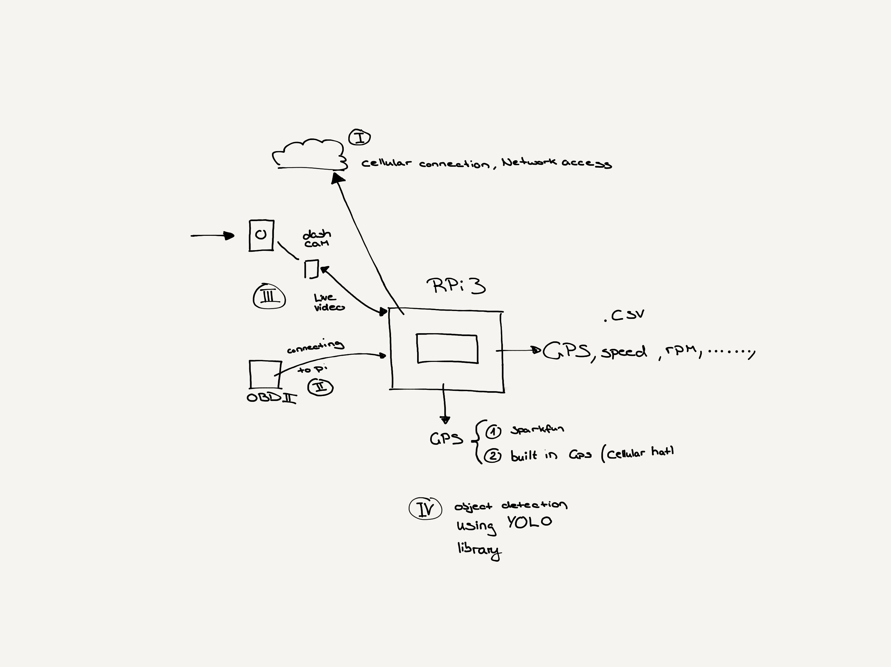

# Connected Cars: Computational Models for Time-Critical Safety Applications
Primary Supervisor: Adel Nadjaran Toosi
Co-Supervisor: Aamir Cheema
Research Area: Data Engineering

[Internal Wiki](https://sites.google.com/a/monash.edu/disnet-lab-wiki/projects?authuser=1)

Connected vehicles need to be aware of their surrounding environments. This is impossible without being dependent on many sensory inputs. Sensor data is continually collected and analysed, in real-time in order to perform time-critical and delay-sensitive actions. There are two major challenges 1) limited computational resources (processing power and memory) on cars, 2) transfer of large sensory data to the cloud may is not feasible. In this project, we aim at building scheduling and task offloading techniques to share the computation tasks between the vehicles and cloud considering the computational resources of the vehicles, Quality of Service (QoS) requirements of the applications (e.g., required response time), and available bandwidth.

### Tasks

- [ ] Cellular Connection
- [ ] built in GPS setup (cellular)
  -Buy new one, cant connect to celluular. Message to previous people who worked on it
- [ ] sparkfun GPS setup 
- [ ] GPS .csv upload with scheduling to cloud
- [x] Raspberry Pi setup
- [x] Object detection YOLO library
  -In progress, rather difficult wiht tinyyolo because libraries have not been updated as well as incompatilibty with latest raspbian. 
  -Do you want a usb accelerator like google coral?
  -figure out how to export to csv
- [x] OBDII pi data
  -Emulate with python on a communication port (most likelly) https://github.com/Ircama/ELM327-emulator
  -Rip one out of a car
  -Borrow a car
  -Purchase a OBD-II emulator $200+
  -working so far in conjunction with dashcam
  -Delegate task to member will require purchase of 
  
- [x] Dashcam live video
  -Working, ask how he wants overall system to work? 
  -Finished otherwise utilising repo
  https://github.com/JVital2013/RoadApplePi

phone number for cellular connection: 0421 495 425 OPTUS
